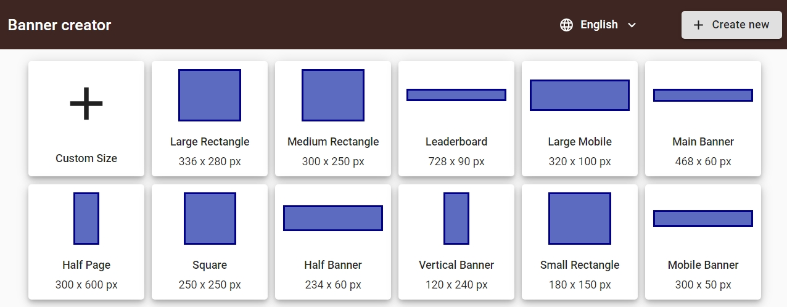
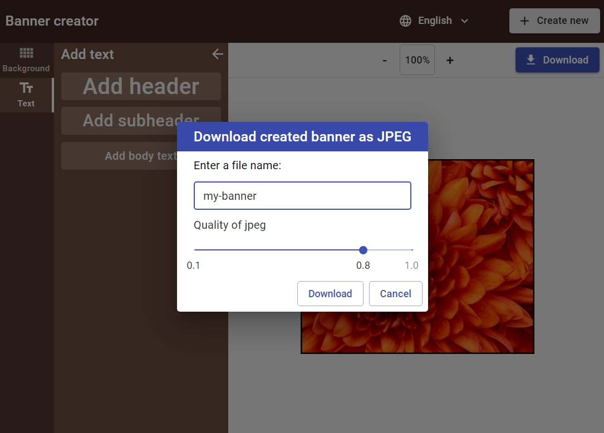

# Banner-creator
Ссылка: https://alexaltrex.github.io/Banner-creator

## Описание
Редактор для создания баннеров. Приложение имеет возможность выбора языка (английский/русский). Баннер состоит из заднего фона и текста. Задний фон может быть: монохромный цвет, градиент (горизонтальный, вертикальный или радиальный) или локальное изображение. Также баннер может имет границу. Текст можно перемещать, удалять и редактировать его параметры: содержание, размер, цвет, наклон, верхний/нижний регистр. Максимальное количество строк текста - 3. Созданный баннер можно сохранить в форматах: png, jpeg и html.

## Запуск проекта:
Для установки и запуска необходимы установленные программы: Node.js, npm, Git;
1. Клонирование и запуск: git clone https://github.com/Alexaltrex/Banner-creator.git;
2. Переход в директорию с проектом: cd Banner-creator;
3. Установка зависимостей: npm install;
4. Запуск проекта в режиме разработки: npm start;
5. Перейти в браузер и открыть страницу: http://localhost:3999.

## Разработка
* Приложение разработано на базе библиотеки React v.17.0.1 с использованием Create React App (https://github.com/facebook/create-react-app)
* Глобальное состояние: управление - Redux v.4.0.5, доступ - хуки useSelector и useDispatch
* Все компонетны - "глупые", вместо оберток - кастомные хуки
* Локальное состояние: хук "useState"
* Побочные эффекты: хук "useEffect"
* Роутинг: react-router-dom v.5.2.0
* Асинхронный код: Redux-thunk v.2.3.0
* Работа с формами: Redux-form v.8.3.7
* Дизайн: Material-UI v.4.11.0, styled-components v. 5.2.1
* Типизация: Typescript v.4.0.5
* Загрузка локальных файлов: react-dropzone: v. 11.2.4
* Перетаскивание (drag and drop): react-dnd: v. 11.1.3

## Структура проекта
* assets - ресурсы;
* Components - react компоненты;
* css - стилизация для react-colorful;
* DrarAndDrop - константы для react-dnd;
* Store - управление глобальным состоянием (store, reducers, selectors);
* Types - типы typescript;
* Utils - утилиты (константы, перевод, валитаторы форм);

## Структура приложения

## 1. Страница с выбором размера беннера.

## 2. Страница с редактором баннера.

### 2.1. Заголовок.
Логотип, выбор языка приложения, кнопка созднания нового баннера.

### 2.2. Главная боковая панель.
Задний фон, Текст.

### 2.3. Вторая боковая панель.
* Задний фон: цвет, градиент или локальное изображение, граница.
* Текст: Заголовок, подзаголовок и основной текст.

### 2.4. Рабочее пространство.
* Верхняя панель: масштабирование и сохранение
* Основное рабочее простанство: превью баннера и панель редактирования свойств текста

